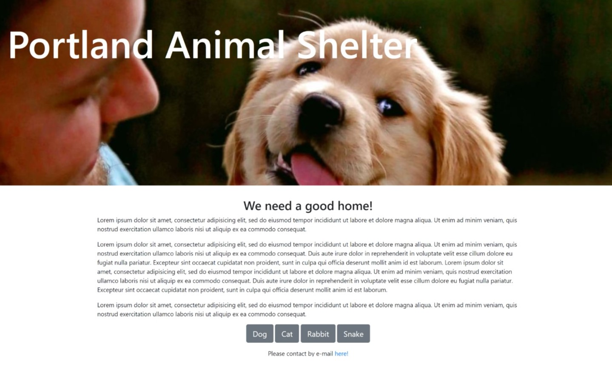

# _Animal Shelter_

#### By _**Victoria Martinez**_

## Description

In this project we explored the use of commits and push to remote repository on GitHub.  It also showcase the practice of changing the styles of elements on the page according to cascading precedence.

## Objectives:
 
Create a new web page for an animal shelter. List out the animals available to be adopted, including pictures and descriptions of each animal. Have at least 3-5 animals listed. Display each animal's "profile" in a column.
Change the styles of elements nested within the columns using the idea of cascading.
Find other places in your web pages where you can change elements on the page according to cascading precedence.

## Preview of project

## Setup/Installation Requirements

* _Turn on computer_
* _Clone project on github: https://github.com/vmartinezlive/Animal-Shelter.git
* _Open file on terminal 
* _Open HTML on a browser of your choice_

## Known Bugs

_There is no known bugs_

## Support and contact details

_Contact: Victoria Martinez by emailing to: vmartinez72@live.com_

## Technologies Used

_Computer, HTML 5, BootstrapCDN, GitHub_

### License

Copyright (c) 2018 **_Victoria Martinez_**